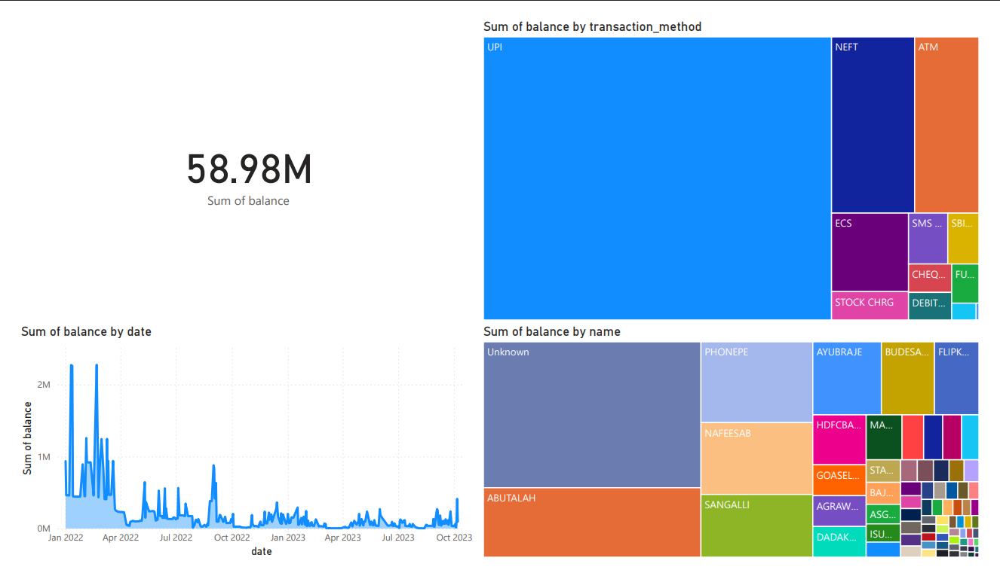

#  Banking Dashboard

A simple, interactive Power BI dashboard project demonstrating a data analyst workflow: **data cleaning**, **exploration**, and **visualization** of personal bank transactions.

##  Project Overview

This dashboard analyzes and visualizes bank statement data to help users:

- **Track spending and income trends**
- **Categorize expenses**
- **Monitor account balances over time**
- **Interactively filter and drill down into transaction data**

Built with **Power BI** for dashboarding and **Python** (pandas, jupyter) for data cleaning. This project illustrates core data analyst skills in a practical context.

---

##  Features

- **Clear dashboard layout**: Visualizes balances, incomes, expenses, and trends
- **Interactive filters**: Slice by category, date, or account
- **Drill-down capability**: Explore individual transactions and aggregate summaries
- **Custom visuals**: Bar charts, line graphs

---

##  Tech Stack

- **Power BI Desktop** — Dashboard creation & visualization
- **Python 3.x & pandas/jupyter** — Data cleaning and transformation
- **Postgres** — Data storage, data integrity and transfer

---

